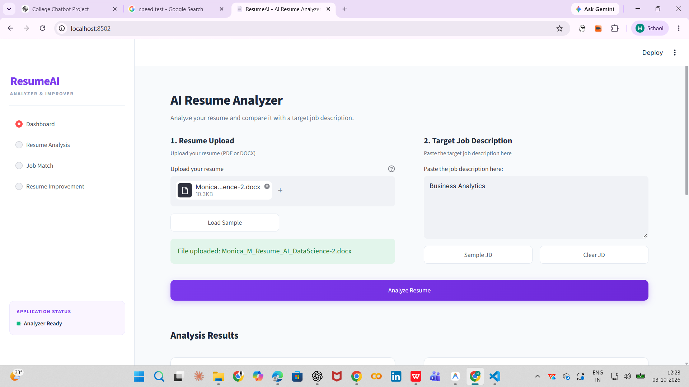

# 🤖 AI Resume Analyzer

An AI-powered resume analysis application that analyzes resumes, extracts relevant information, evaluates skills, and provides insights to help improve a candidate's resume.

## 📸 Application Preview




## 🚀 Features

* 📄 Resume parsing and information extraction
* 🧠 AI-based resume analysis
* 🛠️ Skill identification
* 📊 Resume evaluation and analysis
* 💼 Job-role based skill comparison
* 📋 Structured analysis results
* 🧪 Test files for core functionality
* 🎯 Helps identify areas for resume improvement

## 🛠️ Technologies Used

* **Python**
* **Streamlit**
* **Natural Language Processing (NLP)**
* **JSON**
* **Python testing**
* **AI/ML techniques**

## 📂 Project Structure

```text
AI_Resume_Analyzer/
│
├── app.py
├── analyzer.py
├── resume_parser.py
│
├── data/
│   ├── job_roles.json
│   └── skills.json
│
├── test_analyzer.py
├── test_parser.py
├── requirements.txt
├── .gitignore
└── README.md
```

## ⚙️ Installation

### 1. Clone the repository

```bash
git clone https://github.com/YOUR_USERNAME/ai-resume-analyzer.git
```

### 2. Open the project

```bash
cd ai-resume-analyzer
```

### 3. Create a virtual environment

```bash
python -m venv venv
```

### 4. Activate the virtual environment

**Windows PowerShell:**

```bash
venv\Scripts\Activate.ps1
```

### 5. Install dependencies

```bash
pip install -r requirements.txt
```

## ▶️ Run the Application

Start the Streamlit application using:

```bash
streamlit run app.py
```

The application will open in your browser.

## 🧪 Run Tests

To run the analyzer tests:

```bash
python -m pytest
```

## 💡 How It Works

```text
Resume Upload
      ↓
Resume Parsing
      ↓
Information Extraction
      ↓
Skill Identification
      ↓
Job Role Comparison
      ↓
Resume Analysis
      ↓
Improvement Insights
```

## 🎯 Use Cases

* Students preparing resumes for internships
* Fresh graduates preparing for placements
* Job seekers evaluating their resumes
* Identifying missing skills for a target role
* Understanding resume strengths and improvement areas

## 🔮 Future Enhancements

* Resume ATS compatibility scoring
* Multiple resume format support
* More job-role categories
* AI-generated resume improvement suggestions
* Job description matching
* Resume keyword optimization
* Interactive analytics dashboard

## 👩‍💻 Author

**Mithra S.**

B.Tech – Artificial Intelligence & Data Science

---

⭐ If you find this project useful, consider giving the repository a star!
